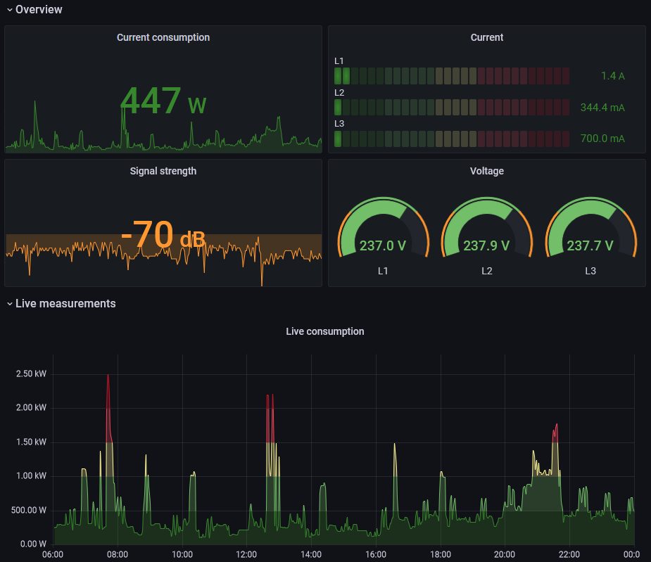

# Tibber Pulse

Scripts and [pipelines](https://dev.azure.com/stefanes/tibber-pulse/_build) for publishing energy prices and consumption to [Grafana/Graphite](https://grafana.com/docs/grafana/latest/datasources/graphite/).

| Highlighted pipelines | Build status |
| --------------------- | ------------ |
| [tibber-price-tomorrow](https://dev.azure.com/stefanes/tibber-pulse/_build?definitionId=199&_a=summary) | [](https://dev.azure.com/stefanes/tibber-pulse/_build/latest?definitionId=199&repoName=stefanes%2Ftibber-pulse&branchName=main) |
| [tibber-consumption-1h](https://dev.azure.com/stefanes/tibber-pulse/_build?definitionId=201&_a=summary) | [](https://dev.azure.com/stefanes/tibber-pulse/_build/latest?definitionId=201&repoName=stefanes%2Ftibber-pulse&branchName=main) |
| [tibber-live](https://dev.azure.com/stefanes/tibber-pulse/_build?definitionId=200&_a=summary)           | [](https://dev.azure.com/stefanes/tibber-pulse/_build/latest?definitionId=200&repoName=stefanes%2Ftibber-pulse&branchName=main)           |



## Installation

Before manually running the scripts in found in this repo you need to first install and setup the following PowerShell modules:

* [PSTibber](https://github.com/stefanes/PSTibber)
* [PSGraphite](https://github.com/stefanes/PSGraphite)

See [here](https://github.com/stefanes/PSTibber#authentication) and [here](https://github.com/stefanes/PSGraphite#authentication) for how to setup authentication.

## Usage examples

### Get today's or tomorrow's energy prices

Use [`tibber-price.ps1`](tibber-price.ps1) to get tomorrow's (or today's) energy prices and publish the data (if the `-Publish` switch is provided) in the following Graphite series:

| Graphite series            | Measurement | Unit        | Resolution |
| -------------------------- | ----------- | ----------- | ---------- |
| `tibber.hourly.price`      | `total`     | SEK         | 1h         |
| `tibber.hourly.priceLevel` | `level`     | _See below_ | 1h         |
| `tibber.hourly.priceScore` | N/A         | _See below_ | 1h         |

The `tibber.hourly.priceLevel` series contains the price levels as defined [here](https://developer.tibber.com/docs/reference#pricelevel), translated into the following values:

| Price level      | Value |
| ---------------- | ----- |
| `VERY_CHEAP`     | 10    |
| `CHEAP`          | 20    |
| `NORMAL`         | 30    |
| `EXPENSIVE`      | 40    |
| `VERY_EXPENSIVE` | 50    |

The `tibber.hourly.priceScore` series contains a custom price score as defined below:

| Price score | Value | Definition                              |
| ----------- | ----- | --------------------------------------- |
| `LOW`       | -10   | The 8 most expensive hours              |
| `MEDIUM`    | 0     | The 8 hours not scoring `LOW` or `HIGH` |
| `HIGH`      | 10    | The 8 cheapest hours                    |

Tomorrow's energy prices, display in terminal and publish to Graphite:

```powershell
PS> .\tibber-price.ps1 -Tomorrow -Publish -Verbose
Home ID for 'Vitahuset': 96a14971-525a-4420-aae9-e5aedaa129ff
Energy price (W. Europe Standard Time):
    0.7542 SEK at 09/23/2022 00:00:00 [level = 10] [score = 50]
    0.7113 SEK at 09/23/2022 01:00:00 [level = 10] [score = 50]
    ...
    1.0319 SEK at 09/23/2022 22:00:00 [level = 10] [score = 50]
    0.8517 SEK at 09/23/2022 23:00:00 [level = 10] [score = 50]

Status |  Published Invalid
------ -  --------- -------
   200 OK 24        0


Status |  Published Invalid
------ -  --------- -------
   200 OK 24        0
```

Today's energy prices (only display in terminal, do not publish to Graphite):

```powershell
PS> .\tibber-price.ps1 -Today
Home ID for 'Vitahuset': 96a14971-525a-4420-aae9-e5aedaa129ff
Energy price (W. Europe Standard Time):
    0.7542 SEK at 09/23/2022 00:00:00 [level = 10] [score = 50]
    0.7113 SEK at 09/23/2022 01:00:00 [level = 10] [score = 50]
    ...
    1.0319 SEK at 09/23/2022 22:00:00 [level = 10] [score = 50]
    0.8517 SEK at 09/23/2022 23:00:00 [level = 10] [score = 50]
```

### Get hourly/daily energy consumption

Use [`tibber-consumption.ps1`](tibber-consumption.ps1) to get the billed consumption and publish the data (if the `-Publish` switch is provided) in the following Graphite series:

| Graphite series             | Measurement   | Unit | Resolution |
| --------------------------- | ------------- | ---- | ---------- |
| `tibber.hourly.consumption` | `consumption` | Wh   | 1h         |
| `tibber.hourly.cost`        | `cost`        | SEK  | 1h         |
| `tibber.daily.consumption`  | `consumption` | Wh   | 1d         |
| `tibber.daily.cost`         | `cost`        | SEK  | 1d         |

Today's hourly energy consumption (last 24 hours):

```powershell
PS> .\tibber-consumption.ps1
Home ID for 'Vitahuset': 96a14971-525a-4420-aae9-e5aedaa129ff
Hourly consumption (W. Europe Standard Time)...
From 09/23/2022 02:00:00 to 09/23/2022 03:00:00 (W. Europe Standard Time):
    3489 W
    2,49 SEK
...
From 09/23/2022 09:00:00 to 09/23/2022 10:00:00 (W. Europe Standard Time):
    177 W
    0,91 SEK
```

Yesterday's total energy consumption:

```powershell
PS> .\tibber-consumption.ps1 -Daily
Home ID for 'Vitahuset': 96a14971-525a-4420-aae9-e5aedaa129ff
Daily consumption from 09/22/2022 00:00:00 to 09/23/2022 00:00:00 (W. Europe Standard Time):
    29451 W
    81,12 SEK
```

### Get hourly/daily energy production

Use [`tibber-production.ps1`](tibber-production.ps1) to get the billed production and publish the data (if the `-Publish` switch is provided) in the following Graphite series:

| Graphite series            | Measurement  | Unit | Resolution |
| -------------------------- | ------------ | ---- | ---------- |
| `tibber.hourly.production` | `production` | Wh   | 1h         |
| `tibber.hourly.profit`     | `profit`     | SEK  | 1h         |
| `tibber.daily.production`  | `production` | Wh   | 1d         |
| `tibber.daily.profit`      | `profit`     | SEK  | 1d         |

Today's hourly energy production (last 24 hours):

```powershell
PS> .\tibber-production.ps1
Home ID for 'Vitahuset': 96a14971-525a-4420-aae9-e5aedaa129ff
Hourly production (W. Europe Standard Time)...
From 09/23/2022 02:00:00 to 09/23/2022 03:00:00 (W. Europe Standard Time):
    3489 W
    2,49 SEK
...
From 09/23/2022 09:00:00 to 09/23/2022 10:00:00 (W. Europe Standard Time):
    177 W
    0,91 SEK
```

Yesterday's total energy production:

```powershell
PS> .\tibber-production.ps1 -Daily
Home ID for 'Vitahuset': 96a14971-525a-4420-aae9-e5aedaa129ff
Daily production from 09/22/2022 00:00:00 to 09/23/2022 00:00:00 (W. Europe Standard Time):
    29451 W
    81,12 SEK
```

### Get live measurements

Use [`tibber-live.ps1`](tibber-live.ps1) to get live measurements and publish the data (if the `-Publish` switch is provided) in the following Graphite series:

| Graphite series               | Measurement       | Unit | Resolution |
| ----------------------------- | ----------------- | ---- | ---------- |
| `tibber.live.power`           | `power`           | W    | 10s        |
| `tibber.live.powerProduction` | `powerProduction` | W    | 10s        |
| `tibber.live.voltagePhase1`   | `voltagePhase1`   | V    | 10s        |
| `tibber.live.voltagePhase2`   | `voltagePhase2`   | V    | 10s        |
| `tibber.live.voltagePhase3`   | `voltagePhase3`   | V    | 10s        |
| `tibber.live.currentL1`       | `currentL1`       | A    | 10s        |
| `tibber.live.currentL2`       | `currentL2`       | A    | 10s        |
| `tibber.live.currentL3`       | `currentL3`       | A    | 10s        |
| `tibber.live.signalStrength`  | `signalStrength`  | dB/% | 2m         |

Live measurements until two minutes past the hour:

```powershell
PS> .\tibber-live.ps1
Home ID for 'Vitahuset': 96a14971-525a-4420-aae9-e5aedaa129ff
New GraphQL subscription created: 9d1860e8-4625-4cf9-b865-6737e2dcde9e
Reading metrics until 2022-09-23 11:02 (W. Europe Standard Time)...
Live metrics at 09/23/2022 10:49:48 (W. Europe Standard Time):
    power: 0
    powerProduction: 480
...
Live metrics at 09/23/2022 11:02:08 (W. Europe Standard Time):
    power: 0
    powerProduction: 484
Read 75 package(s) in 743.2731528 seconds
GraphQL subscription stopped: 9d1860e8-4625-4cf9-b865-6737e2dcde9e
```

## Graphite `storage-schemas.conf`

Recommended [`storage-schemas.conf`](https://graphite.readthedocs.io/en/latest/config-carbon.html#storage-schemas-conf) settings:

```ini
[tibber.daily]
  pattern    = ^tibber\.daily\..*
  retentions = 1d:2y
[tibber.hourly]
  pattern    = ^tibber\.hourly\..*
  retentions = 1h:2y

[tibber.live.signalStrength]
  pattern    = ^tibber\.live\.signalStrength$
  retentions = 2m:8w4d
[tibber.live]
  pattern    = ^tibber\.live\..*
  retentions = 10s:1w1d
```

See [here](https://grafana.com/docs/grafana-cloud/data-configuration/metrics/metrics-graphite/http-api/#adjust-storage-schemasconf-and-storage-aggregationconf) for how to change the storage schemas using the config API.

## Time zones

Running these scripts on e.g. Azure Pipelines agent will by default log UTC times. To change this behaviour provide a time zone using the `-TimeZone` parameter:

```powershell
PS> .\tibber-price.ps1 -Today -TimeZone 'India Standard Time'
Home ID for 'Vitahuset': 96a14971-525a-4420-aae9-e5aedaa129ff
Energy price (India Standard Time):
    0.7542 SEK at 09/23/2022 03:30:00 [level = 10] [score = 50]
    0.7113 SEK at 09/23/2022 04:30:00 [level = 10] [score = 50]
    ...
    1.0319 SEK at 09/24/2022 01:30:00 [level = 10] [score = 50]
    0.8517 SEK at 09/24/2022 02:30:00 [level = 10] [score = 50]
```

List all available time zones:

```powershell
Write-Host "Available time zone Ids:"
[TimeZoneInfo]::GetSystemTimeZones() | ForEach-Object {
    Write-Host $_.Id -ForegroundColor White
    Write-Host "Offset: $($_.BaseUtcOffset.ToString())"
}
```

_Note: This will not impact the timestamp sent to Graphite._
